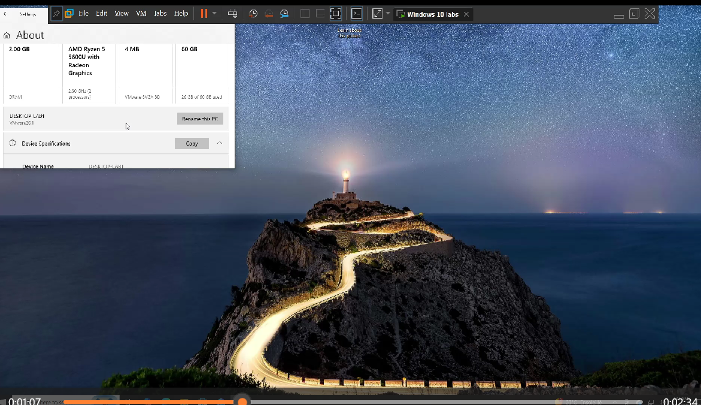
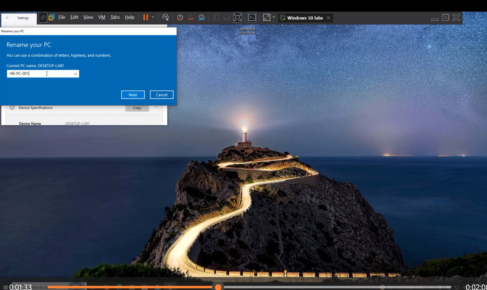
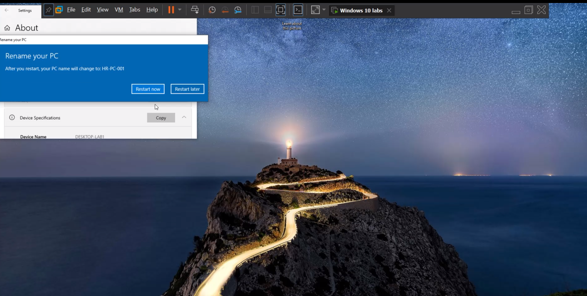
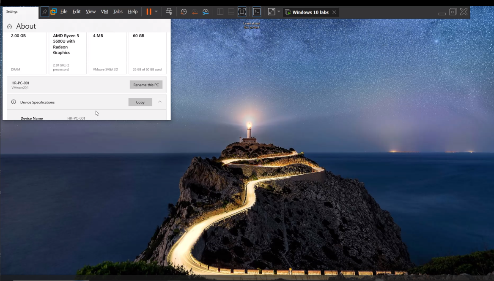

# it-support-ticket-001-rename-windows-workstation
A hands-on IT Support lab demonstrating how to rename a Windows 10 workstation according to enterprise naming standards.

## 🎫 Ticket Information

**Ticket ID:** ITSUP-001

**Title:** Rename a Windows 10 Workstation

**Status:** ✅ Completed

**Role:** IT Support Technician (Home Lab Simulation)

## 🎯 Objective

The objective of this lab was to prepare a Windows 10 workstation for deployment by renaming the computer according to an enterprise naming convention. This task simulates a common responsibility performed by IT Support Technicians when provisioning devices for new employees.

## 🛠️ Tasks Performed

- Verified the existing Windows computer name.
- Renamed the workstation to **HR-PC-001**.
- Restarted the computer to apply the new configuration.
- Verified that the new computer name was successfully applied.

- ## 💻 Skills Demonstrated

- Windows 10 Administration
- Computer Naming Standards
- Windows System Configuration
- IT Support Fundamentals
- Workstation Deployment
- Technical Documentation

- ## 📚 What I Learned

Through this lab, I learned how to identify and rename a Windows workstation using enterprise naming standards. I also learned the importance of verifying configuration changes after restarting the system and documenting technical work in a professional manner.

## 📌 Key Takeaway

Renaming workstations using a standardized naming convention improves device management, troubleshooting, inventory tracking, and communication within an IT environment. Even small configuration tasks contribute to maintaining an organized and secure enterprise infrastructure.

## 📸 Screenshots

### 1. Before Renaming the PC

### 2. Rename Window

### 3. Restart Prompt

### 4. Device Name After Restart

---

## 🎥 Video Demonstration

Watch the complete video walkthrough on YouTube:

▶️ https://youtu.be/kTKL5kuw30A
